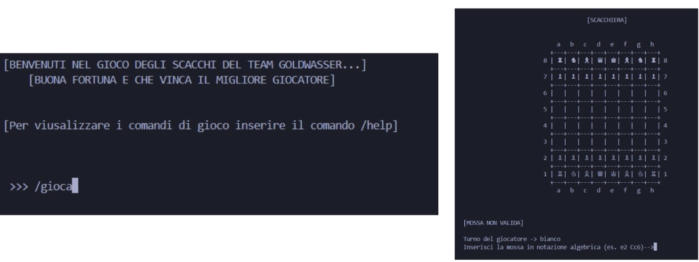
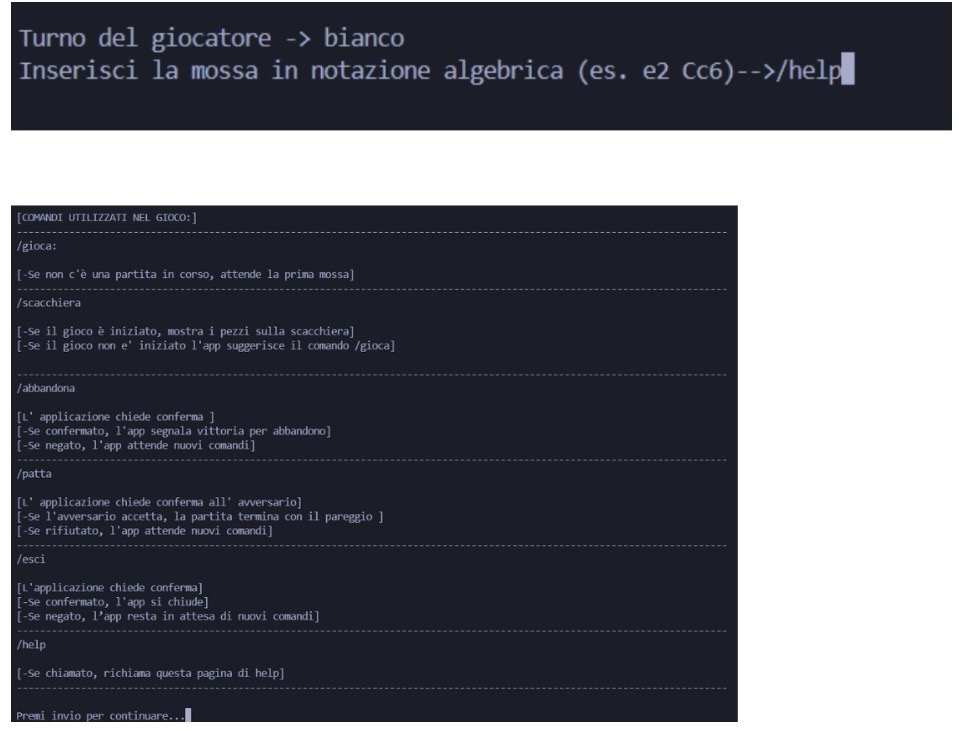
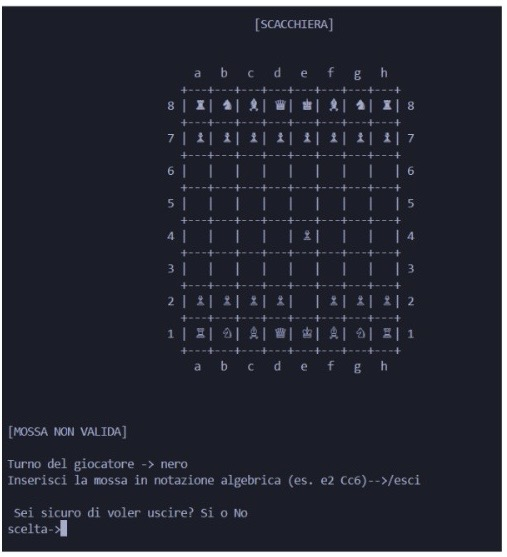
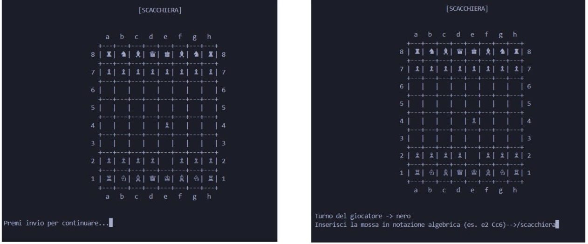
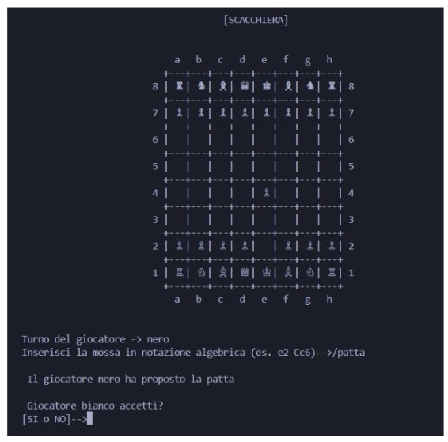
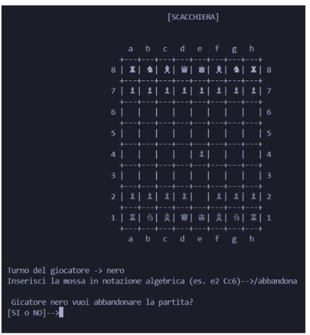
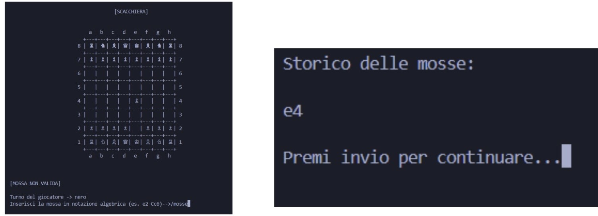
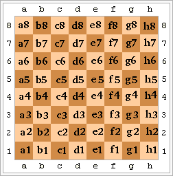

# MANUALE UTENTE

## Descrizione

Questa applicazione consente di interagire con un gioco testuale strategico, in cui due giocatori si sfidano a turni sullo stesso dispositivo. L’interfaccia è interamente testuale: il giocatore può interagire con il sistema digitando comandi da tastiera, che vengono interpretati e processati dall’applicazione.

Per avviare una nuova partita, è sufficiente digitare il comando /gioca. Il sistema alterna automaticamente i turni tra i due giocatori. A ogni turno, il giocatore può eseguire azioni di gioco o accedere ai comandi di sistema. Per consultare l’elenco dei comandi disponibili, è possibile digitare /help.

Nel caso in cui venga inserito un comando non valido, il sistema visualizzerà un messaggio di errore e richiederà all’utente di inserire nuovamente l’istruzione. Per prevenire molteplici input errati, inseriti appositamente, dopo 10 mosse verrà visualizzato un nuovo messaggio di errore.

## Regole di gioco


- **Obiettivo**: Mettere scacco matto al re avversario: attaccarlo senza possibilità di fuga. 

- **Pezzi e Movimenti**: 

  -*Pedone* : avanti di 1 (o 2 all’inizio), cattura in diagonale. Promozione all’ultima riga. 

  -*Torre* : orizzontale e verticale. 

  -*Cavallo* : a “L”, salta i pezzi. 

  -*Alfiere* : solo diagonale. 

  -*Donna* : qualsiasi direzione. 

  -*Re* : una casella in qualsiasi direzione. 

- **Regole Speciali**:

  -*Arrocco* : re e torre insieme, se non si sono mossi. 

  -*En passant* : cattura speciale del pedone. 

  -*Promozione* : il pedone diventa donna, torre, alfiere o cavallo. 

- **Situazioni di Gioco**:

  -*Scacco* : il re è sotto attacco. 

  -*Scacco* matto : fine della partita. 

  -*Stallo* o patta : pareggio in casi particolari. 

- **Turni**:

  -Il bianco muove per primo. 

  -I giocatori si alternano, una mossa alla volta.


## Avvio dell’applicazione

Per avviare l’applicazione è necessario:
1. Eseguire il seguente comando per scaricare l’immagine Docker dell’applicazione:

```Bash
    docker pull ghcr.io/softeng2425-inf-uniba/scacchi-goldwasser:latest
```

2. Eseguire il seguente comando per avviare l’immagine Docker:

```Bash
    docker run --rm -it ghcr.io/softeng2425-inf-uniba/scacchi-goldwasser:latest
```
Dove --rm serve per far si che Docker interrompa l’esecuzione del container nel momento in cui l’applicazione eseguita al suo interno termina; -it invece serve per richiedere un’esecuzione interattiva del container e per allocare uno pseudo-tty connesso allo standard input.

 ## Comandi principali del gioco
 
 - **/gioca** - avvia una nuova partita.



 - **/help** - mostra l’elenco completo dei comandi disponibili.



 - **/esci** - chiude l’applicazione.



 - **/scacchiera** - mostra a video la scacchiera.



 - **/patta** - chiede conferma al giocatore.



 - **/abbandona** - termina la partita in corso.



 - **/mosse** - mostra l’elenco delle mosse compiute durante la partita.

 


 ## Requisiti di sistema
 
Questa applicazione è eseguibile all’interno di un container Docker ed è compatibile con i 
seguenti terminali:

 - **Linux** : Terminal
 - **Mac OS** : Terminal
 - **Windows** : Powershell e Git Bash

 ## Inserimento di una mossa

L’inserimento di una mossa deve avvenire in **notazione algebrica** . 

Ogni casa è identificata da una lettera da a a h e da un numero da 1 a 8, dove la lettera indica la colonna e il numero la traversa. Ogni pezzo è identificato da una lettera maiuscola: il re è indicato con la R, la regina con la D, la torre con la T, l’alfiere con la A e il cavallo con la C.

Per indicare una mossa, la notazione algebrica prevede l’indicazione dell’iniziale del pezzo e della casa di arrivo. Per esempio, per 
spostare un alfiere nella casa c4, si scrive Ac4 .

***N.B.*** : si pressupone che si stia visualizzando il testo in bianco su sfondo nero. 





