# REPORT

# Indice
1. [Introduzione](#1-Introduzione)
2. [Modello di dominio](#2-Modello-di-dominio)
3. [Requisiti specifici](#3-Requisiti-specifici)
    - [Requisiti funzionali](#Requisiti-funzionali)
    - [Requisiti non funzionali](#Requisiti-non-funzionali)
4. [System Design](#4-System-Design)
5. [OO Design](#5-OO-Design)
6. [Riepilogo dei test](#6-Riepilogo-dei-test)
7. [Processo di sviluppo e organizzazione del lavoro](#7-Processo-di-sviluppo-e-organizzazione-del-lavoro)
8. [Analisi retrospettiva](#8-Analisi-retrospettiva)
    - [Sprint 0](#Sprint-0)
    - [Sprint 1](#Sprint-1)

# 1. Introduzione
Il presente documento descrive le fasi di analisi e progettazione del progetto [***"Gioco degli Scacchi"***](https://collab.di.uniba.it/lanubile/), sviluppato nell’ambito del corso di Ingegneria del Software presso l’Università degli Studi di Bari. L'obiettivo del progetto è realizzare un'applicazione software che simuli una partita di scacchi completa, seguendo le regole ufficiali del gioco.

Gli **scacchi** sono un gioco di strategia per due giocatori che si gioca su una **scacchiera** quadrata di 64 caselle, alternate in due colori, organizzate in 8 righe (traverse) e 8 colonne, numerate da 1 a 8 e da "a" a "h". Ogni giocatore dispone di **16 pezzi**: 1 re, 1 regina, 2 alfieri, 2 cavalli, 2 torri e 8 pedoni. L'obiettivo è dare **scacco matto**, cioè minacciare il re avversario senza possibilità di difesa legale.

Il report è strutturato come segue:
- la ***Sezione 2*** presenta il modello di dominio, con le entità principali e le loro relazioni;
- la ***Sezione 3*** definisce i requisiti specifici, distinguendo tra funzionali e non funzionali;
-	La ***Sezione 4*** è dedicata al System Design. Saranno presenti: diagramma dei componenti, utile per visualizzare l'interazione con eventuali elementi esterni, e il diagramma dei package. Inoltre, vengono commentate le decisioni chiave relative ai requisiti non funzionali e ai principi di progettazione adottati;
-	La ***Sezione 5*** si concentra sull'OO Design. In questa sezione sono inclusi il diagramma delle classi e i diagrammi di sequenza per le user story più rilevanti. Sono anche presenti commenti sulle scelte fatte in base ai principi dell'OO design e l'indicazione di eventuali design pattern implementati;
-	La ***Sezione 6*** fornisce un riepilogo dei test eseguiti. Include dettagli sul criterio di selezione dei casi di test, la loro localizzazione e il numero totale di test effettuati;
-	La ***Sezione 7*** descrive il processo di sviluppo e l'organizzazione del lavoro adottati durante il progetto;
- la ***Sezione 8*** contiene un’analisi retrospettiva con considerazioni sullo sviluppo e miglioramenti futuri.

# 2. Modello di dominio
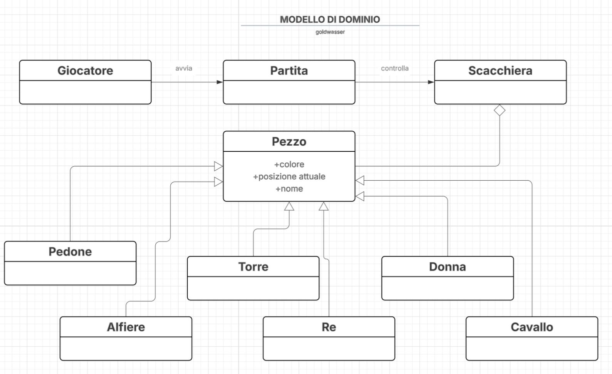

# 3. Requisiti specifici

### Requisiti funzionali

### RF1.   L’APPLICAZIONE DEVE MOSTRARE ELENCO COMANDI
Come giocatore voglio mostrare l'help con elenco comandi

#### CRITERI DI ACCETTAZIONE
- eseguendo il comando
  [ ***/help*** ]
- il risultato è una lista di comandi (uno per riga)

### RF2.   L’APPLICAZIONE DEVE INIZIARE NUOVA PARTITA
Come giocatore voglio iniziare una nuova partita 

#### CRITERI DI ACCETTAZIONE
- eseguendo il comando
  [ ***/gioca*** ]
- l'applicazione si predispone a ricevere la prima mossa di gioco

### RF3.   L’APPLICAZIONE DEVE CHIUDERE IL GIOCO
Come giocatore voglio chiudere il gioco 

#### CRITERI DI ACCETTAZIONE
- eseguendo il comando
  [ ***/esci*** ]
- l'applicazione lascia il controllo al sistema operativo

### RF4.   L’APPLICAZIONE DEVE MOSTRARE LA SCACCHIERA
Come giocatore voglio mostrare la scacchiera con i pezzi 

#### CRITERI DI ACCETTAZIONE
- eseguendo il comando
  [ ***/scacchiera*** ]
- l'applicazione mostra la posizione di tutti i pezzi sulla scacchiera

### RF5.   L’APPLICAZIONE DEVE PROPORRE LA PATTA
Come giocatore voglio proporre la patta

#### CRITERI DI ACCETTAZIONE
- eseguendo il comando
  [ ***/patta*** ]
- l'applicazione chiede conferma all’avversario, se l’avversario    accetta, la partita termina con il pareggio 

### RF6.   L’APPLICAZIONE DEVE ABBANDONARE LA PARTITA
Come giocatore voglio abbandonare la partita

#### CRITERI DI ACCETTAZIONE
- eseguendo il comando
  [ ***/abbandona*** ]
- l’applicazione comunica che l’avversario ha vinto per abbandono

### RF7.   L’APPLICAZIONE DEVE MUOVERE UN PEDONE
Come giocatore voglio muovere un pedone

#### CRITERI DI ACCETTAZIONE
- scrivendo il comando in notazione algebrica abbreviata degli scacchi in italiano
   - la mossa deve essere legale
   - se si tenta una mossa non valida viene visualizzato un messaggio mossa illegale e l'applicazione rimane in attesa di una mossa valida

- ***movimento del pedone***: 
   - I pedoni si muovono in avanti e possono solo avanzare e di una sola casa per volta. 
   - Quando un pedone si muove per la prima volta può però avanzare anche di due case. 
   - Non possono mai indietreggiare, né catturare all'indietro. 
   - Se un altro pezzo è collocato direttamente davanti al pedone, quest'ultimo non può né superarlo, né catturarlo. 

### RF8.   L’APPLICAZIONE DEVE MOSTRARE LE MOSSE GIOCATE
Come giocatore voglio mostrare le mosse giocate

#### CRITERI DI ACCETTAZIONE
- eseguendo il comando
  [ ***/mosse***]
- l'applicazione mostra la storia delle mosse compiute fino a quel moment

### RF9.   L'APPLICAZIONE DEVE MUOVERE UN PEDONE CON CATTURA
Come giocatore voglio muovere un pedone

### CRITERI DI ACCETTAZIONE
- l'app deve accettare mosse in notazione algebrica abbreviata in italiano 
- la mossa deve rispettare le regole degli scacchi: 
  - I pedoni hanno la particolarità di muoversi e di catturare in due modi diversi: si muovono in avanti, ma catturano in diagonale. I pedoni possono solo avanzare e di una sola casa per volta. Quando un pedone si muove per la prima volta può però avanzare anche di due case. I pedoni catturano solo sulle case poste immediatamente davanti a loro, in diagonale. Non possono mai indietreggiare, né catturare all'indietro. Se un altro pezzo è collocato direttamente davanti al pedone, quest'ultimo non può né superarlo, né catturarlo. 
- se si tenta una mossa non valida è mostrato il messaggio "mossa illegale" e l'applicazione rimane in attesa di una mossa valida

### RF10.  L'APPLICAZIONE DEVE MUOVERE LA DONNA
Come giocatore voglio muovere la donna

### CRITERI DI ACCETTAZIONE
- l'app deve accettare mosse in notazione algebrica abbreviata in italiano 
- la mossa deve rispettare le regole degli scacchi 
- la Donna può catturare pezzi 
- se si tenta una mossa non valida è mostrato il messaggio "mossa illegale" e l'applicazione rimane in attesa di una mossa valida 

### RF11.  L'APPLICAZIONE DEVE MUOVERE UNA TORRE
Come giocatore voglio muovere una torre

### CRITERI DI ACCETTAZIONE
- l'app deve accettare mosse in notazione algebrica abbreviata in italiano 
- la mossa deve rispettare le regole degli scacchi 
- la Torre può catturare pezzi 
- se si tenta una mossa non valida è mostrato il messaggio "mossa illegale" e l'applicazione rimane in attesa di una mossa valida 

### RF12.  L'APPLICAZIONE DEVE MUOVERE UN ALFIERE
Come giocatore voglio muovere un alfiere

### CRITERI DI ACCETTAZIONE
- l'app deve accettare mosse in notazione algebrica abbreviata in italiano 
- la mossa deve rispettare le regole degli scacchi 
- l'Alfiere può catturare pezzi 
- se si tenta una mossa non valida è mostrato il messaggio "mossa illegale" e l'applicazione rimane in attesa di una mossa valida 

### RF13.  L'APPLICAZIONE DEVE MUOVERE UN CAVALLO
Come giocatore voglio muovere un cavallo

### CRITERI DI ACCETTAZIONE
- l'app deve accettare mosse in notazione algebrica abbreviata in italiano 
- la mossa deve rispettare le regole degli scacchi 
- il Cavallo può catturare pezzi 
- se si tenta una mossa non valida è mostrato il messaggio "mossa illegale" e l'applicazione rimane in attesa di una mossa valida 

### RF14.  L'APPLICAZIONE DEVE MUOVERE UN RE SENZA ARROCCO
Come giocatore voglio muovere un re senza arrocco

### CRITERI DI ACCETTAZIONE
- l'app deve accettare mosse in notazione algebrica abbreviata in italiano  
- la mossa deve rispettare le regole degli scacchi:
  - il Re non può muoversi in case minacciate da pezzi avversari 
  - il Re può catturare pezzi 
- se si tenta una mossa non valida è mostrato il messaggio "mossa illegale" e l'applicazione rimane in attesa di una mossa valida 

### RF15. L'APPLICAZIONE DEVE POTER GIOCARE UN ARROCCO
Come giocatore voglio giocare un arrocco

### CRITERI DI ACCETTAZIONE
- la mossa deve rispettare le regole degli scacchi 
- Una sola volta in tutta la partita ciascun re può usufruire di una mossa speciale, nota come arrocco, che consiste nel muovere il re di due case in direzione della torre lato re (arrocco corto) o della torre lato donna (arrocco lungo) e successivamente, sempre durante lo stesso turno, muovere la torre verso la quale il re si è mosso nella casa compresa tra quelle di partenza e di arrivo del re. Questo si può fare solamente se tutte le condizioni seguenti sono soddisfatte: 
  - Il giocatore non ha ancora mosso né il re né la torre coinvolta nell'arrocco; 
  - Non ci devono essere pezzi (amici o avversari) fra il re e la torre utilizzata; 
  - Né la casa di partenza del re, né la casa che esso deve attraversare, né quella di arrivo devono essere minacciate da un pezzo avversario. 
- l'app deve accettare mosse in notazione algebrica abbreviata in italiano L'arrocco corto viene indicato con 0-0 
- L'arrocco lungo viene indicato con 0-0-0 

### RF16.  L'APPLICAZIONE DEVE MUOVERE UN RE SOTTO SCACCO
Come giocatore voglio muovere un re sotto scacco

### CRITERI DI ACCETTAZIONE
- l'app deve accettare mosse in notazione algebrica abbreviata in italiano 
- la mossa deve rispettare le regole degli scacchi 
- Il re è l'unico pezzo che non può mai essere catturato, ma solo minacciato. Quando un re è minacciato, trovandosi sulla traiettoria di un pezzo nemico, si dice che è "sotto scacco"; non è consentita alcuna mossa che ponga o lasci il proprio re in tale condizione.  
o	Per eliminare la minaccia si deve procedere in uno dei seguenti modi: 
  - muovere il re in una delle case adiacenti, a patto che questa non sia sotto il controllo di un pezzo avversario; 
  - catturare, con il re o con un altro pezzo, il pezzo avversario che si trova sulla traiettoria del re e dà origine allo scacco; 
  - nel caso di minaccia da parte di donna, torre o alfiere non adiacenti al re sotto attacco, frapporre tra quest'ultimo e il pezzo che minaccia scacco un qualunque pezzo o pedone, in modo che sia quest'ultimo a essere minacciato invece del re. 
- Se nessuna delle mosse che il giocatore può effettuare è in grado di liberare il re dallo scacco, si tratta di scacco matto e la partita termina con la vittoria dell'avversario.  
- Se invece il re non si trova sotto scacco ma non è possibile effettuare alcuna mossa legale (ad esempio se si ha solo il re in gioco ed esso non è sotto scacco ma tutte le case ad esso adiacenti sono minacciate), si tratta di stallo e la partita termina con un risultato di parità, non potendo il giocatore che si trova in questa condizione muovere senza contravvenire alle regole del gioco. 

### RF17. L'APPLICAZIONE DEVE POTER PROMUOVERE UN PEDONE
Come giocatore voglio promuovere un pedone

### CRITERI DI ACCETTAZIONE
- l'app deve accettare mosse in notazione algebrica abbreviata in italiano
- la mossa deve rispettare le regole degli scacchi 
- Se un pedone riesce ad avanzare fino all'ottava traversa, viene promosso, ossia assume il ruolo e le capacità di movimento di un altro pezzo dello stesso colore (donna, torre, alfiere o cavallo) a scelta del giocatore, indipendentemente dai pezzi già presenti sulla scacchiera. In questo modo è dunque possibile avere un numero di esemplari di un certo pezzo maggiore rispetto a quello iniziale. 

### Requisiti non funzionali
### RNF18.   	
L'applicazione Scacchi viene eseguita tramite macchina virtuale Linux grazie alla containerizzazione docker. Pertanto dovrà essere eseguito su sistemi operativi e macchine che supportano la virtualizzazione OS.

### RNF19.   
L'utente deve conoscere la [notazione algebrica](https://it.wikipedia.org/wiki/Notazione_algebrica) "abbreviata" italiana per poter giocare in quanto l'applicazione è prettamente testuale.

### RNF20.
Il gioco può essere eseguito sui sistemi operativi più comuni (Linux, macOS, Microsoft Windows) su shell apposite:
***Linux***
- Terminal incluso nell'OS;

***macOS***
- Terminale incluso nell'OS;

***Microsoft Windows***
- Windows Terminal
- Git Bash for Windows

N.B.: l'utente dovrà installare Docker a prescindere dal sistema operativo o shell utilizzati.

# 4. System Design

## Diagramma dei componenti:
Non abbiamo fatto ricorso a componenti esterni, come librerie o parser già pronti, perché la complessità delle user story da implementare non lo richiedeva. Abbiamo valutato che le funzionalità necessarie potessero essere soddisfatte in modo efficace attraverso lo sviluppo interno delle componenti. In particolare, abbiamo scelto di realizzare noi stessi il parser, progettandolo e implementandolo su misura per il nostro progetto.
Questa scelta ci ha permesso di avere un controllo diretto sulla logica applicativa, evitando dipendenze esterne e semplificando la comprensione dell’architettura complessiva. Inoltre, lo sviluppo interno ha garantito una maggiore manutenibilità, poiché il codice è interamente scritto e documentato da noi, ed è facilmente estendibile, qualora in futuro fosse necessario introdurre nuove funzionalità o adattarsi a user story più complesse. Il risultato è un sistema coerente, modulare e progettato per crescere senza compromettere la qualità del codice.

## Diagramma dei package:
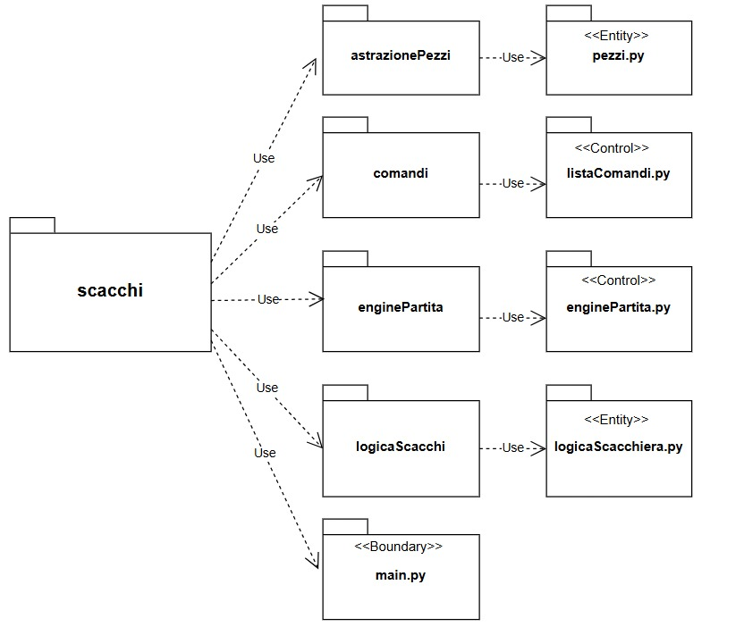

## Architettura dell'applicazione:
Il progetto è stato strutturato per garantire la massima modularità e scalabilità. A tal fine, è stato adottato il pattern architetturale Entity-Control-Boundary (ECB), che suddivide le classi in tre categorie distinte:
- ENTITY: classi che rappresentano le entità del dominio del problema. In particolare, si occupano di modellare le entità del gioco e di gestire le loro interazioni.
- CONTROL: classi responsabili della logica applicativa, che coordinano le interazioni tra le entità e gestiscono gli input provenienti dalle classi boundary.
- BOUNDARY: classi dedicate all’interfacciamento con l’utente e alla gestione della presentazione. Si occupano di ricevere i comandi dall’utente e di mostrare i risultati delle operazioni.

I package finali dell’applicazione sono i seguenti:
- astrazionePezzi
Contiene il file pezzi.py con classi di tipo entity che rappresentano il concetto di pedina e ne gestiscono la logica di movimento generale.

- comandi
Contiene il file listaComandi.py, che incapsula la logica relativa alla gestione dei comandi (tipologia control).

- enginePartita
Contiene il file enginePartita.py, incaricato di orchestrare la logica di gioco in modo coerente (tipologia control).

- logicaScacchi
Contiene il file logicaScacchiera.py, che astrae il concetto di scacchiera e ne gestisce la logica (tipologia entity).

## Decisioni prese in riferimento ai requisiti non funzionali e ai principi di progettazione:
Durante la progettazione e implementazione dell’applicazione Scacchi, sono state adottate una serie di decisioni finalizzate al rispetto dei requisiti non funzionali e dei principi fondamentali dell’ingegneria del software.

***Portabilità e compatibilità multisistema***: Per garantire la massima portabilità tra ambienti diversi, l’applicazione è stata containerizzata tramite *Docker. Questa scelta consente di eseguire il software su qualsiasi sistema operativo che supporti la virtualizzazione di tipo OS, tra cui *Linux, macOS e Windows, a condizione che siano soddisfatti i requisiti minimi di sistema (es. supporto a Hyper-V, SLAT, ecc.). L’utilizzo del container Docker permette anche di evitare problemi di configurazione e dipendenze specifiche del sistema operativo.

***Interfaccia testuale universale***: L’interfaccia utente è stata realizzata in modalità testuale, utilizzando caratteri UTF-8 e codici ANSI per il supporto al colore e alla visualizzazione grafica della scacchiera. Questo approccio garantisce compatibilità con tutti i terminali moderni (Linux terminal, macOS Terminal, Windows Terminal, Git Bash), evitando la necessità di librerie grafiche esterne e rendendo l'applicazione leggera ed eseguibile anche in ambienti minimali.

***Semplicità d’uso e requisiti per l’utente***: Poiché l’applicazione si basa sulla notazione algebrica italiana abbreviata, è richiesto che l’utente ne conosca le basi. Abbiamo deciso di non introdurre un’interfaccia interattiva più complessa, in linea con l’obiettivo di mantenere l’applicazione snella, testuale e orientata all’apprendimento logico del gioco.

***Modularità e manutenibilità del codice***: Il sistema è stato progettato con una forte attenzione alla *modularità, separando chiaramente le responsabilità tra classi (ad esempio Pezzo, Scacchiera, EnginePartita). Questo approccio semplifica la *manutenzione del codice e facilita il debug, lo sviluppo incrementale e l’eventuale estensione futura.

***Evitare dipendenze esterne non necessarie***: Abbiamo scelto consapevolmente di *non utilizzare librerie o parser esterni, poiché le funzionalità richieste potevano essere realizzate internamente con un livello di complessità gestibile. Il parser della notazione è stato infatti *sviluppato da zero, assicurando maggiore controllo sul comportamento del sistema e riducendo la dipendenza da tecnologie terze.

***Estendibilità futura***: L’architettura è pensata per essere facilmente estesa, ad esempio per aggiungere nuove modalità di gioco, pezzi personalizzati o un’interfaccia grafica. L’uso di classi ben isolate e strutturate garantisce che nuove funzionalità possano essere aggiunte senza compromettere la struttura esistente.

# 5. OO Design

- Diagramma delle classi dell'intero progetto:

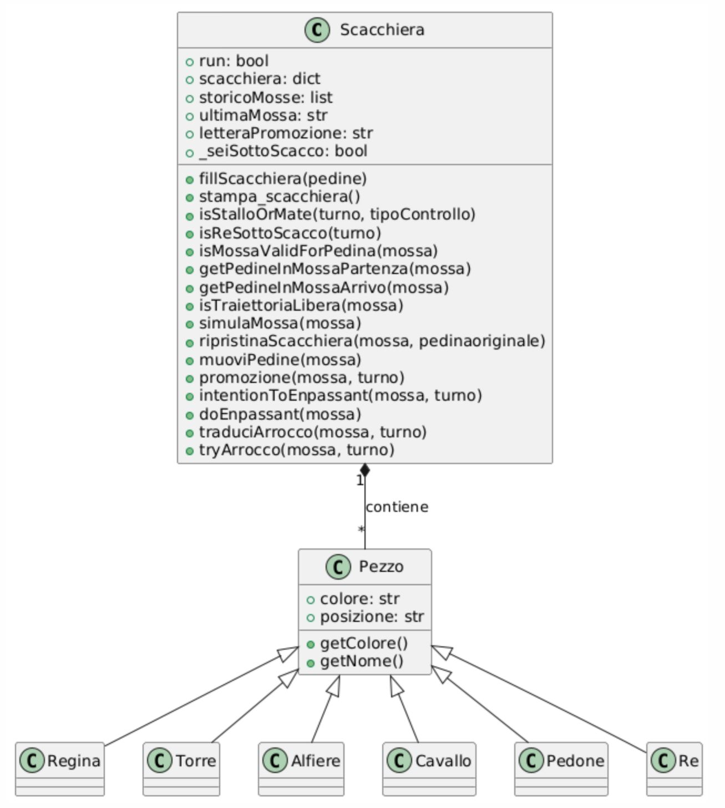

- Diagramma delle classi per le user stories che interessano il **movimento di un pezzo** sulla scacchiera:

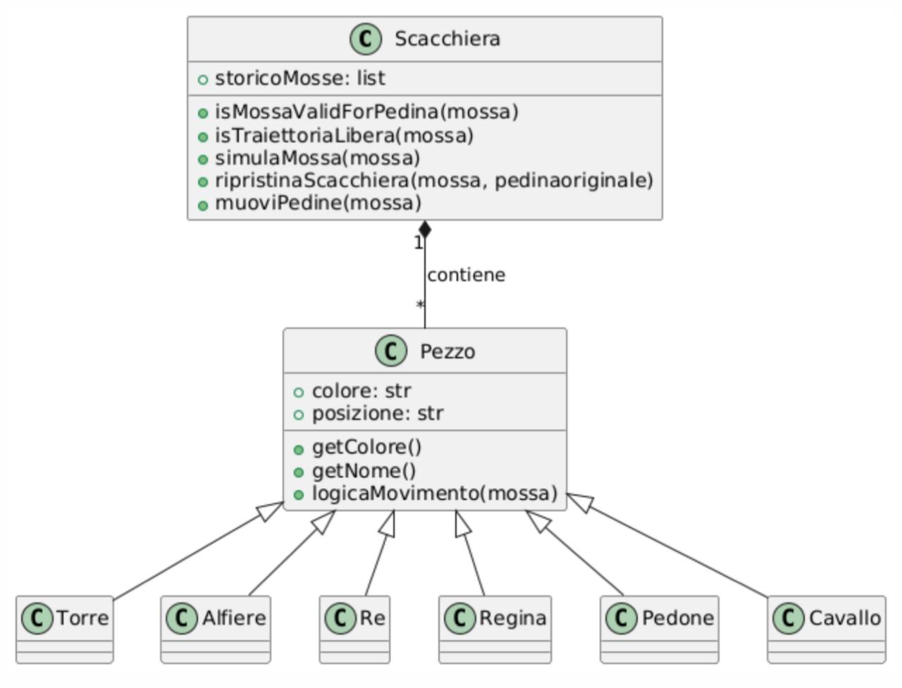

- Diagramma di sequenza relativo alle user stories del **movimento di un pezzo** sulla scacchiera:

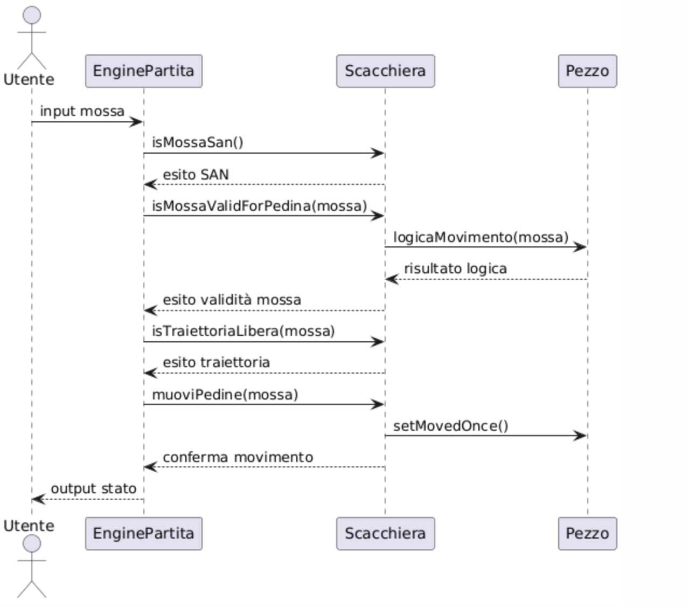

- Diagramma delle classi per le user stories che interessano **lo scacco e lo scacco matto**:

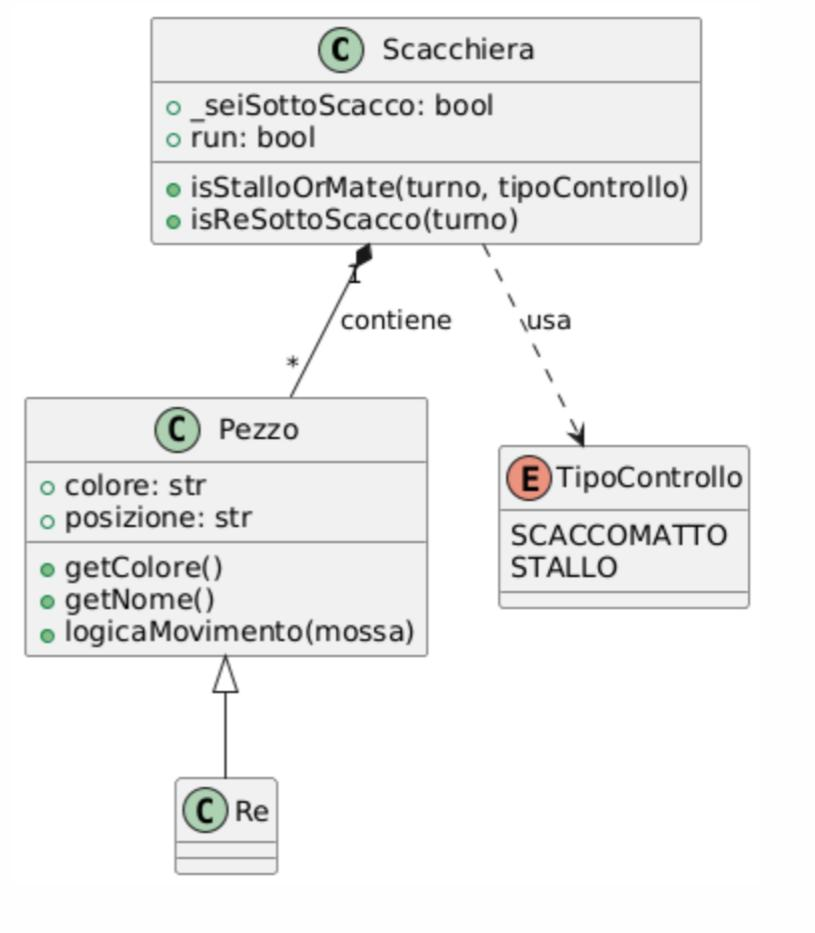

- Diagramma di sequenza relativo alle user stories che interessano **lo scacco e lo scacco matto**:

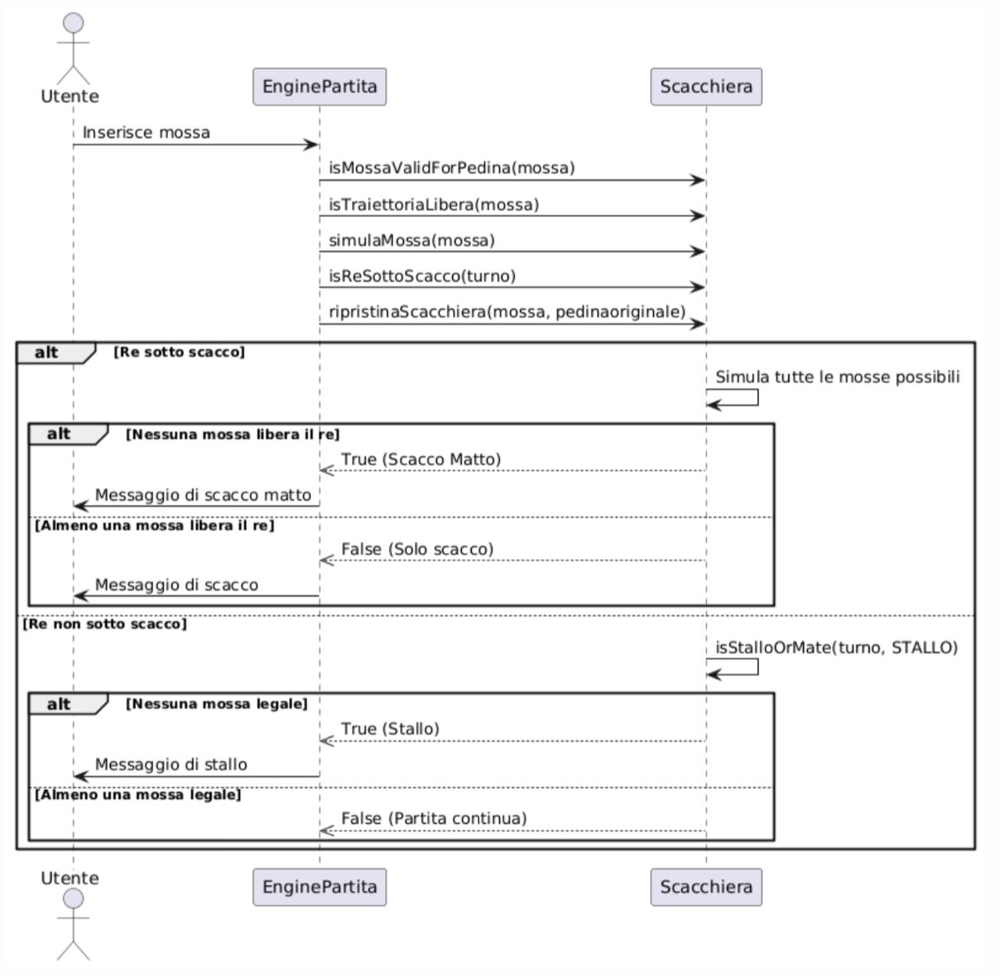

- Diagramma delle classi per le user stories che interessano **l'arrocco**: 

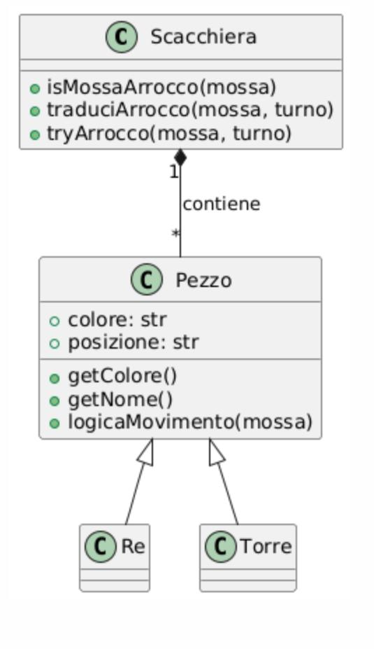

- Diagramma di sequenza relativo alle user stories **dell'arrocco**:

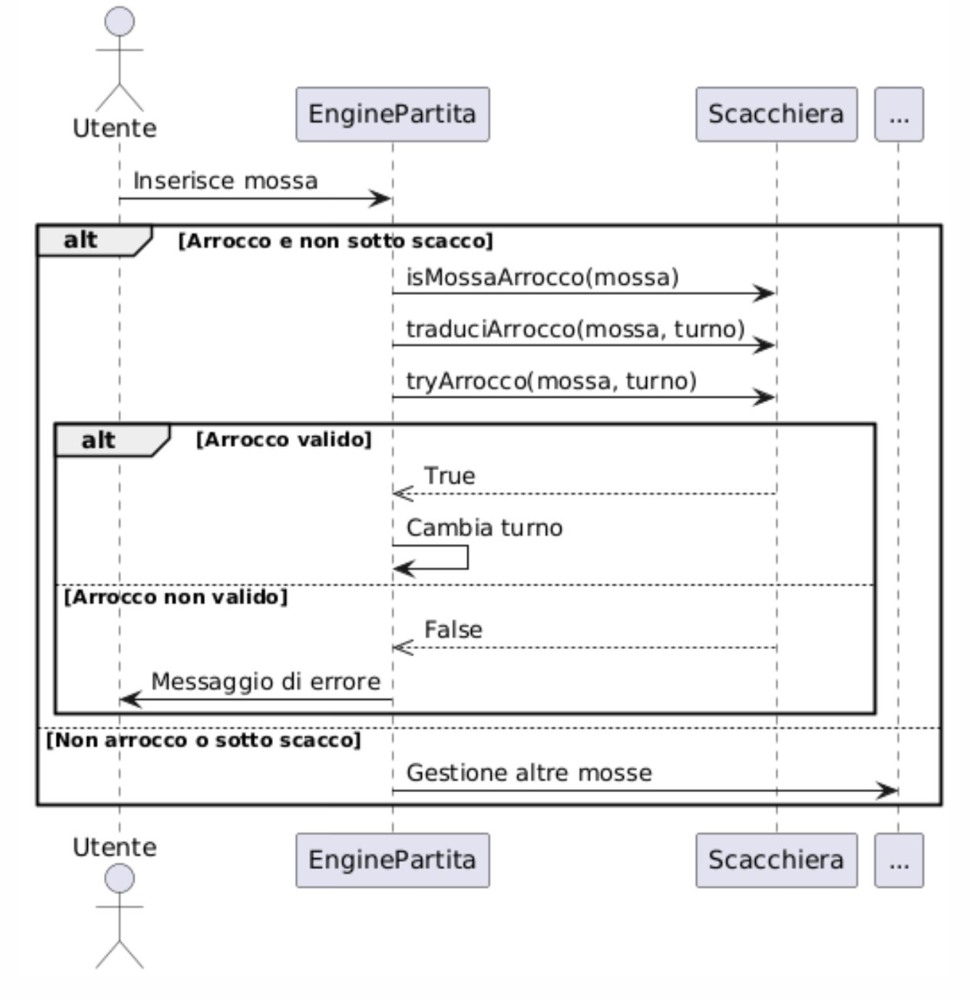

- Diagramma delle classi per le user stories che interessano **l'en passant**:

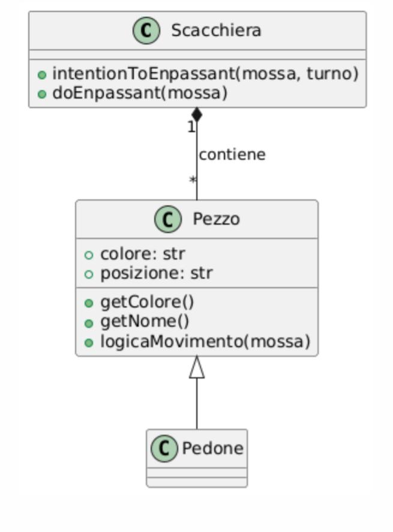

- Diagramma di sequenza relativo alle user stories che interessano **l'en passant**:

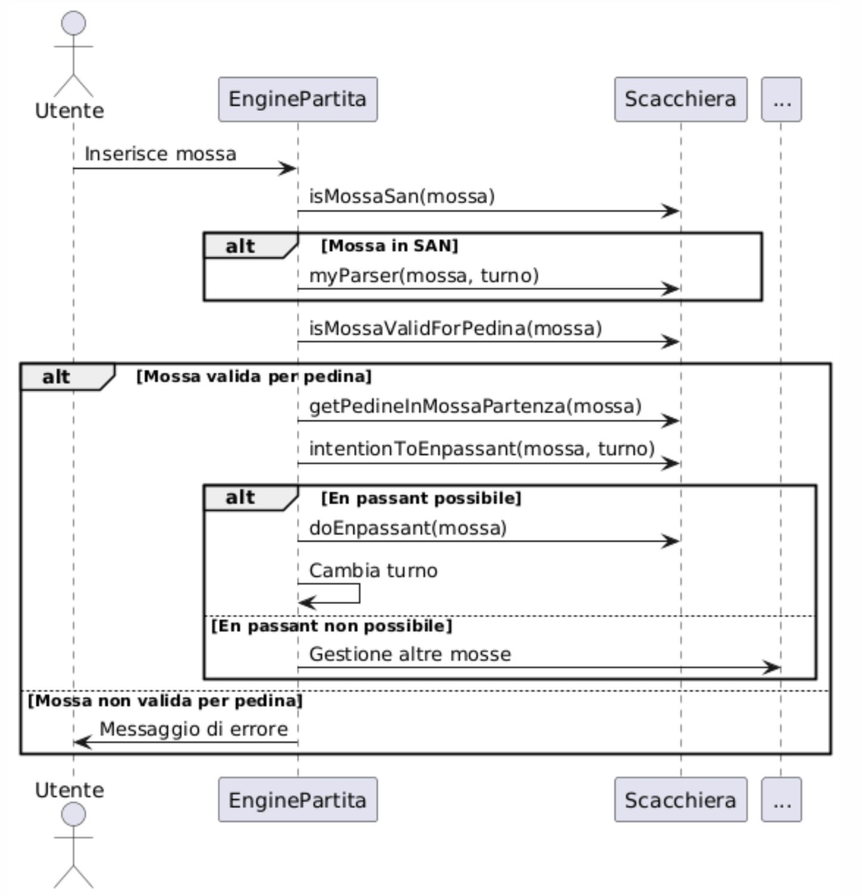

Ogni diagramma di sequenza coinvolge l’interazione con *EnginePartita*, classificata come **Control**, nonché con le classi *Scacchiera* e *Pezzo*, entrambe di tipo **Entity**. Questo perché *EnginePartita* utilizza internamente le funzionalità offerte da entrambe le classi. 
Per quanto riguarda il *Main*, di tipo **Boundary**, essa viene interpellata esclusivamente all’avvio dell’applicazione e al termine di una partita. In effetti, il vero svolgimento della partita è gestito da *EnginePartita*, il cui ruolo operativo ha inizio soltanto quando il giocatore digita il comando /gioca.

 
# 6. Riepilogo dei test 
Nel progetto di scacchi è stata condotta una fase di testing mirata a verificare il corretto funzionamento delle componenti più critiche del sistema. La selezione dei casi di test è stata guidata dall’importanza funzionale e dalla complessità logica delle operazioni implementate. 
I casi di test sono stati testati sul file logicaScacchiera.py e pezzi.py.

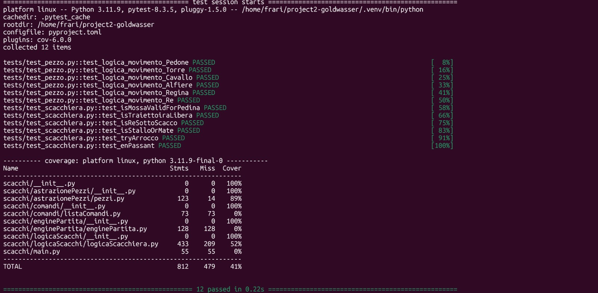

## Criteri di selezione dei casi di test:

- ***Criticità Funzionale***: Priorità è stata data alle funzioni cardine per la logica del gioco, il cui malfunzionamento avrebbe compromesso l'integrità della partita. Questo ha incluso la verifica di:
- La funzione che controlla la presenza di uno scacco (es. isReSottoScacco()). 
- Le due funzioni principali di movimento dei pezzi. 
- La funzione che rileva lo scacco matto. 
- Le funzioni che gestiscono le mosse speciali (arrocco, en passant, promozione). 
- ***Complessità Logica e Rischio di Difetti***: Funzioni algoritmicamente complesse o con numerosi rami decisionali sono state testate prioritariamente data la loro maggiore propensione agli errori logici.
- ***Copertura dei Requisiti***: Ogni test è stato ideato per validare specifici requisiti del gioco degli scacchi, assicurando l'aderenza alle regole. L'obiettivo è stato coprire sistematicamente gli scenari di gioco fondamentali.
- ***Test di Confine e Scenari Estremi***: Per le funzioni di movimento e rilevamento dello stato della partita, sono stati predisposti test per scenari "normali" e casi limite (es. Re in posizioni estreme o di blocco), valutando il comportamento del sistema in condizioni particolari.
- ***Test Positivi e Negativi***: Sono stati sviluppati test per validare sia l'esecuzione corretta delle operazioni (es. mosse legali) sia la gestione di input/condizioni non valide (es. mosse illegali, configurazioni anomale della scacchiera), per assicurare la robustezza del sistema.

## Localizzazione dei casi di test:

I test sono stati implementati all’interno della cartella tests/, creata inizialmente dai docenti. Al suo interno sono stati aggiunti file dedicati al collaudo delle funzioni principali. La struttura è stata mantenuta coerente e ordinata, facilitando la scrittura, esecuzione e manutenzione dei test.

## Numero dei casi di test:

Sono stati sviluppati complessivamente circa 12 casi di test, ciascuno mirato a verificare un aspetto specifico delle funzionalità selezionate. I test hanno avuto esito positivo in tutti i casi, grazie anche alla progettazione modulare delle funzioni, pensate per poter essere testate in isolamento. 
Ad esempio, per testare le funzionalità legate allo scacco, è stato predisposto uno scenario minimo con una scacchiera contenente almeno un Re, condizione necessaria per la valutazione corretta dello stato della partita. 

# 7. Processo di sviluppo e organizzazione del lavoro

Lo sviluppo dell'applicazione Scacchi ha seguito un approccio basato sul framework Scrum, una metodologia agile che favorisce la collaborazione tra i membri del team e il raggiungimento di obiettivi significativi attraverso iterazioni continue. Scrum fornisce valori, ruoli e linee guida che aiutano i team a lavorare in modo strutturato, favorendo il miglioramento costante. 

Il progetto si è articolato in tre sprint della durata di circa quindici giorni ciascuno. A scopo didattico, il Professore ha assunto i ruoli di Product Owner, gestendo il Product Backlog, e di Scrum Master, guidando il team nella comprensione delle regole, dei valori e dei principi alla base di Scrum. 

Prima dell’inizio di ogni sprint, venivano comunicati gli obiettivi da raggiungere, espressi sotto forma di User Stories corredate da una Definition of Done. Ogni sprint era supportato da una board dedicata, utilizzata per monitorare l’avanzamento delle attività. 

## Obiettivi degli Sprint

Alla fine di ciascuno sprint, il team puntava a raggiungere uno Sprint Goal, ovvero un obiettivo chiaro e condiviso. Questo veniva definito attraverso: 
- una lista di User Stories da completare; 
- una serie di issue riguardanti bug, problemi tecnici (major e minor) o documentazione da produrre. 

## Rappresentazione e Gestione delle Attività

Le attività degli sprint sono state organizzate tramite una GitHub Project Board, configurata secondo le seguenti colonne: 
- TO DO: attività ancora da iniziare; 
- IN PROGRESS: attività in fase di sviluppo; 
- REVIEW: attività in attesa della build di GitHub Actions e revisione interna; 
- READY: attività completate, in attesa di approvazione da parte dei docenti; 
- DONE: attività concluse e approvate, che non richiedono ulteriori modifiche. 

## Organizzazione del Lavoro

Il team ha operato in modo auto-organizzato, gestendo in autonomia la suddivisione dei compiti. Ogni membro ha contribuito con responsabilità e flessibilità, collaborando attivamente alla risoluzione delle problematiche e al raggiungimento degli obiettivi comuni. 

## Gestione dello Sviluppo con GitHub Flow

Lo sviluppo è stato coordinato secondo il GitHub Flow: 
- Ogni attività era rappresentata da una issue, assegnata a uno o più membri del gruppo. 
- Per ogni issue veniva creato un branch dedicato, su cui veniva sviluppata la funzionalità o risolto il problema. 
- Al termine dello sviluppo, il codice veniva testato e sottoposto a revisione tramite pull request. 
- Una volta approvato dal team, il branch veniva fuso nel branch principale (main) tramite operazione di merge, dopo aver risolto eventuali conflitti. 

## Comunicazione e Collaborazione

I Daily Meeting si sono svolti in presenza, permettendo un confronto diretto ed efficace. Alcune sessioni di sviluppo si sono tenute in remoto, tramite Microsoft Teams, strumento rivelatosi molto utile grazie alla possibilità di condividere lo schermo e alla gestione delle attività tramite GitHub. 

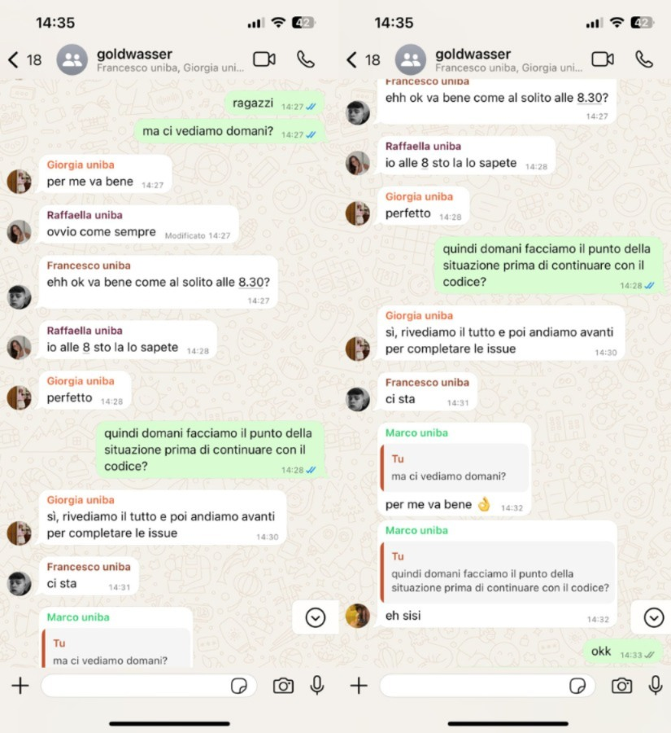

## Pianificazione degli sprint

## SPRINT NUMERO 0

**Descrizione:** Dimostrare familiarità con Git, GitHub Flow e processo agile 

**Data inizio/fine:** 20 marzo – 10 aprile 

**Data feedback:** settimana 14-18 aprile 

L'obiettivo principale di questo sprint era dimostrare familiarità con Git, GitHub e con la metodologia Agile. 

Durante questa fase iniziale, sono state definite le linee guida per lo sviluppo e il comportamento da adottare all'interno del team, al fine di creare un contesto di lavoro positivo e collaborativo.  

In fase di analisi, si è lavorato alla risoluzione dei primi issue, con l'intento di prendere confidenza con il flusso di lavoro e con gli strumenti messi a disposizione. 

Le attività previste in questo sprint erano incentrate principalmente sulla documentazione. Questo approccio ha permesso ai membri del gruppo di familiarizzare con i tool e i processi. 

Durante l’implementazione, si è proceduto alla risoluzione delle issue assegnate, sempre con l’obiettivo di esercitarsi nell’uso degli strumenti e assimilare il processo di sviluppo. 

Infine, si è verificato che le modifiche effettuate non introducessero errori. 

## SPRINT NUMERO 1

**Descrizione:** MVP con pedoni in apertura 

**Data inizio/fine:** 28-29 aprile – 15 maggio 

**Data feedback:** settimana 26-27 maggio 

L’obiettivo principale di questo Sprint era quello di gettare le basi per lo sviluppo del gioco. In questo sprint il team ha avviato la realizzazione concreta del gioco, concentrandosi sull’implementazione dei primi comandi essenziali. 

Durante la fase di analisi, le issue sono state distribuite tra i membri del team, principalmente in coppie, cercando di combinare le competenze in modo bilanciato: chi aveva maggiore esperienza nello sviluppo è stato affiancato a chi era più portato per la documentazione. Alcune issue più semplici sono stati invece assegnati a singoli componenti. 

Ogni coppia ha esposto la propria proposta di soluzione alle issue assegnate. Il resto del gruppo ha partecipato attivamente alla discussione, ponendo domande e offrendo suggerimenti per ottimizzare le scelte progettuali. Questo confronto ha favorito una maggiore coesione e qualità del lavoro. 

Le soluzioni concordate sono state poi tradotte in codice, rispettando le convenzioni di sviluppo condivise dal team. Ogni componente ha lavorato in modo autonomo ma coordinato, garantendo coerenza tra le varie parti del progetto. 

Infine, è stata eseguita una fase di verifica per assicurarsi che le funzionalità implementate fossero prive di errori e aderenti agli standard stabiliti. Questo ha permesso di consolidare quanto sviluppato e di mantenere alta la qualità del codice sin dalle prime fasi. 

## SPRINT NUMERO 2

**Descrizione:** Chiudere la partita con uno scacco matto 

**Data inizio/fine:** 30 maggio – 15 giugni 

**Data feedback:** 23 giugno 

L’obiettivo di questo Sprint era di completare lo sviluppo del gioco, garantendo al tempo stesso un’elevata qualità del software. 

Come nello sprint precedente, le issue sono state assegnate a coppie di lavoro. In questa fase, particolare attenzione è stata data alla manutenzione evolutiva del codice esistente: l’obiettivo era ridurre ridondanze e migliorare la struttura complessiva. Tuttavia, grazie alla visione progettuale già consolidata nello sprint precedente, le modifiche necessarie si sono rivelate minime. 

Sono stati realizzati diversi artefatti progettuali fondamentali: il diagramma dei package, i diagrammi delle classi, e i diagrammi di sequenza. Questi strumenti hanno supportato una visione chiara e condivisa della struttura del progetto. 

Le issue sono state affrontate sulla base delle soluzioni discusse in fase di progettazione, mantenendo la coerenza con le regole di sviluppo definite nei precedenti sprint. Una volta concluse le user story principali, il team ha dedicato tempo alla manutenzione del codice, richiedendo feedback attivo tra i membri tramite i canali di comunicazione interni. Questo ha permesso di migliorare ulteriormente la qualità del software prima della fase finale. 

Le funzionalità implementate sono state verificate per assicurarsi che non presentassero errori e rispettassero gli standard di sviluppo del team. Inoltre, è stato eseguito un testing automatico tramite Pytest per validare il comportamento del gioco rispetto ai requisiti richiesti, contribuendo così alla garanzia di qualità del prodotto finale. 

# 8. Analisi Retrospettiva

### Aspetti Positivi:
- Abbiamo avuto l’occasione di imparare un nuovo linguaggio di programmazione, approfondendone la sintassi e le logiche principali.
- L’esperienza ci ha permesso di applicare realmente i concetti della programmazione ad oggetti.
- Abbiamo lavorato sull’interfaccia del gioco, imparando a utilizzare stili, colori e formattazioni per renderla più accattivante e funzionale.
- Il progetto ci ha dato la possibilità di lavorare in gruppo, migliorando la comunicazione e la capacità di organizzazione.
- Siamo orgogliosi di aver realizzato un gioco strategico storico di una certa complessità, che rappresenta un risultato concreto del nostro lavoro.

### Aspetti Negativi:
- La gestione del tempo è stata una sfida continua, soprattutto nelle ultime settimane, quando si sono sovrapposti altri progetti e scadenze universitarie.
- Alcuni momenti di programmazione sono stati frustranti per via della difficoltà nel capire concetti nuovi o poco praticati.
- In alcune situazioni abbiamo ricevuto direttive poco chiare, che hanno portato a decisioni rischiose.

### Sprint 0
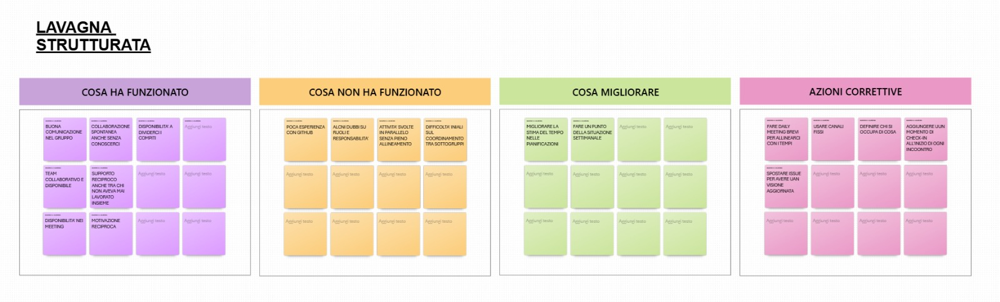

### Sprint 1
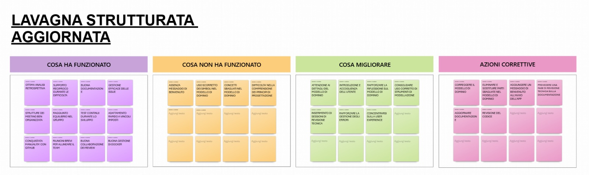

### Conclusioni e azioni correttive per l'evoluzione dell'app:
Lo sviluppo dell’app di scacchi ha rappresentato un’esperienza positiva sia dal punto di vista tecnico che collaborativo. Il lavoro svolto ha portato alla realizzazione di un’app funzionale, ben strutturata e con solide basi su cui costruire ulteriori evoluzioni. Il progetto ha dimostrato la validità dell’approccio adottato e la buona coesione del team.

Per continuare ad evolvere l'app e trasformarla in un prodotto più completo e orientato all’utente finale, si suggeriscono le seguenti azioni correttive:
- Ottimizzazione dell’interfaccia grafica, rendendola più intuitiva, fluida e compatibile con diversi dispositivi (es. mobile).
- Aggiunta della modalità multiplayer online, con gestione delle partite in tempo reale e autenticazione degli utenti.
- Integrazione di un’intelligenza artificiale per permettere partite contro il computer, con livelli di difficoltà configurabili.
- Implementazione della funzionalità di salvataggio e revisione delle partite, con supporto al formato PGN.
- Inserimento di un sistema di suggerimenti e aiuti per utenti meno esperti, utile anche a scopo didattico.
- Raccolta di feedback dagli utenti tramite test di usabilità, per guidare le priorità evolutive.
- Introduzione di test automatici e integrazione continua (CI/CD) per garantire qualità e stabilità del codice nel tempo.

Questi interventi permetterebbero di passare da un’app prototipale a un prodotto solido, ricco di funzionalità e pronto per un utilizzo reale e continuativo

